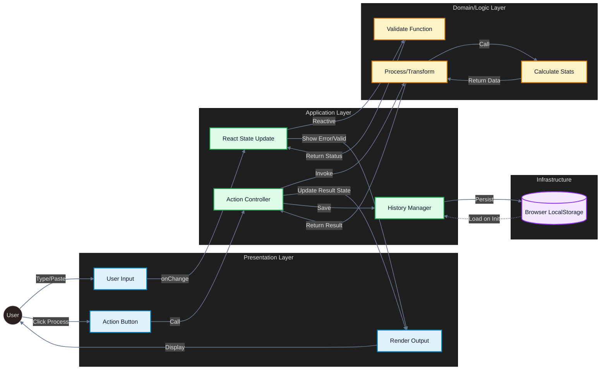

<div align="center">

# DevFlow AI

### 15 developer tools &middot; 0 external deps &middot; 100% local &middot; Open Source

### 15 herramientas para developers &middot; 0 deps externas &middot; 100% local &middot; Open Source

[](https://github.com/albertoguinda/devflow-ai/actions)
[](https://github.com/albertoguinda/devflow-ai)
[-blue?style=flat-square&logo=vitest&logoColor=white)](https://github.com/albertoguinda/devflow-ai)
[](https://github.com/albertoguinda/devflow-ai)
[](LICENSE)
[](https://nextjs.org)
[](https://www.typescriptlang.org)
[](https://tailwindcss.com)

**[English](#-what-is-this)** &middot; **[Castellano](#-para-que-sirve)** &middot; **[TFM Documento](./docs/TFM.md)** &middot; **[TFM Slides (PDF)](./docs/TFM-Slides.pdf)**

</div>

---

<!-- ==================== ENGLISH ==================== -->

## What Is This

15 tools that save you time every day as a developer.

**No login. No API keys. No backend. Everything runs in your browser.**

---

## Tools

|       | Tool                       | Description                                                                              |
| ----- | -------------------------- | ---------------------------------------------------------------------------------------- |
| `{ }` | **JSON Formatter**         | Format, minify, validate JSON. Extract paths, diff documents, generate TS interfaces.    |
| `Aa`  | **Variable Name Wizard**   | Generate variable names and convert between 8 conventions (camel, snake, kebab...).      |
| `#`   | **Regex Humanizer**        | Explain regex in plain language. Generate patterns from descriptions. Real-time tester.  |
| `< >` | **Code Review Assistant**  | Code quality analysis: code smells, cyclomatic complexity, refactoring suggestions.      |
| `$`   | **API Cost Calculator**    | Compare costs across OpenAI, Anthropic, Google and other providers. Monthly projections. |
| `01`  | **Base64 Encoder/Decoder** | Encode/decode with URL-safe, data URL and Unicode support.                               |
| `id`  | **UUID Generator**         | Generate UUID v1, v4, v7. Validation, parsing and bulk generation up to 1000.            |
| `->`  | **DTO-Matic**              | Convert JSON to TypeScript interfaces, entities and mappers. Zod schemas included.       |
| `>>`  | **Git Commit Generator**   | Conventional commits with types, scopes, emojis and real-time validation.                |
| `*`   | **Cron Builder**           | Visual cron expression builder with execution preview.                                   |
| `~`   | **Tailwind Sorter**        | Sort Tailwind classes by category, remove duplicates, order variants.                    |
| `?`   | **Prompt Analyzer**        | Evaluate prompt quality, detect injections and suggest improvements.                     |
| `Tk`  | **Token Visualizer**       | Real-time tokenization visualization with per-token cost estimation.                     |
| `[ ]` | **Context Manager**        | Organize LLM context windows with chunking and prioritization.                           |
| `200` | **HTTP Status Finder**     | Complete reference of 55+ HTTP status codes with examples and usage guides.              |

---

## Features

- **No signup** &mdash; no login, no user accounts
- **No external APIs** &mdash; everything processed in the browser
- **Local history** &mdash; localStorage persistence
- **Copy to clipboard** &mdash; 1-click from any tool
- **Dark / Light mode** &mdash; auto-detection + manual toggle
- **Strategic test coverage** &mdash; 100/80/0 architecture with per-file enforcement
- **TypeScript strict** &mdash; all strict flags enabled, zero `any`
- **Clean Architecture** &mdash; Domain, Application, Presentation layers
- **WCAG AAA accessibility** &mdash; keyboard nav, ARIA labels, skip links

---

## Tech Stack

| Layer      | Technology                                                      |
| ---------- | --------------------------------------------------------------- |
| Framework  | [Next.js 16](https://nextjs.org) (App Router + Turbopack)       |
| UI Library | [React 19](https://react.dev)                                   |
| Language   | [TypeScript 5](https://www.typescriptlang.org) (maximum strict) |
| Styling    | [Tailwind CSS 4](https://tailwindcss.com) (CSS-first config)    |
| Components | [HeroUI v3 beta](https://heroui.com) (compound pattern)         |
| Icons      | [Lucide React](https://lucide.dev)                              |
| Animations | [GSAP](https://gsap.com) + [Framer Motion](https://motion.dev)  |
| Testing    | [Vitest](https://vitest.dev) + Testing Library                  |
| Linting    | ESLint 9 (flat config)                                          |

---

## Architecture

```
├── app/                    # Pages & layouts (App Router)
│   ├── (marketing)/        # Landing, about
│   └── (dashboard)/        # Dashboard + 15 tool pages + docs
├── components/             # UI components
├── hooks/                  # Custom React hooks ("use client")
├── lib/
│   └── application/        # Pure business logic (no React)
├── types/                  # TypeScript interfaces
└── config/                 # Tool registry & configuration
```

**Dependency flow:** `Presentation -> Application -> Domain`

Each tool follows a 5-file pattern:

```
types/<tool>.ts             → Interfaces & types
lib/application/<tool>.ts   → Pure logic (no React)
hooks/use-<tool>.ts         → Hook with state & localStorage
app/.../tools/<slug>/page   → UI page
tests/.../<tool>.test.ts    → Unit tests
```



---

## Quick Start

```bash
git clone https://github.com/albertoguinda/devflow-ai.git
cd devflow-ai
npm install
npm run dev
```

Open [http://localhost:3000](http://localhost:3000)

---

## Scripts

| Command                 | Description                            |
| ----------------------- | -------------------------------------- |
| `npm run dev`           | Dev server (Turbopack)                 |
| `npm run build`         | Production build                       |
| `npm run lint`          | ESLint                                 |
| `npm run type-check`    | TypeScript `tsc --noEmit`              |
| `npm run test`          | Vitest watch mode                      |
| `npm run test:run`      | Single test run                        |
| `npm run test:coverage` | Coverage with per-file thresholds      |
| `npm run audit:security`| npm audit (high + critical)            |

---

## Testing Strategy: 100/80/0

We follow a **Strategic Coverage** architecture. Not all code needs the same level of testing:

| Tier               | Path                         | Target  | Rationale                                              |
| ------------------ | ---------------------------- | ------- | ------------------------------------------------------ |
| **CORE (100%)**    | `lib/application/*.ts`       | 80-100% | Pure business logic, data transformation, security     |
| **IMPORTANT (80%)**| `components/shared/*.tsx`     | 80%     | User-facing UI components with interactive behavior    |
| **INFRA (0%)**     | `types/`, `config/`, stores  | 0%      | TypeScript compiler enforces correctness               |

**Per-file enforcement** is enabled: each CORE file must individually meet thresholds. The CI pipeline fails if any file drops below its floor.

```bash
npm run test:run                                             # All tests
npx vitest run tests/unit/application/json-formatter.test.ts # Single file
npx vitest run -t "should format"                            # By pattern
npm run test:coverage                                        # Coverage report
```

---

## Security

### HTTP Headers

All responses include strict security headers via `next.config.ts`:

| Header                       | Value                                    |
| ---------------------------- | ---------------------------------------- |
| `Content-Security-Policy`    | Strict CSP with `frame-ancestors 'none'`, `object-src 'none'`, `upgrade-insecure-requests` |
| `Strict-Transport-Security`  | `max-age=63072000; includeSubDomains; preload` |
| `X-Content-Type-Options`     | `nosniff`                                |
| `X-Frame-Options`            | `DENY`                                   |
| `Permissions-Policy`         | camera, mic, geolocation disabled        |
| `Referrer-Policy`            | `strict-origin-when-cross-origin`        |

### Design Principles

- **No backend** &mdash; zero server-side attack surface
- **No API routes** &mdash; all processing happens in the browser
- **No user data** &mdash; localStorage only, no external transmission
- **CSP enforced** &mdash; blocks XSS, clickjacking, and data injection
- **Prototype pollution protection** &mdash; dangerous keys (`__proto__`, `constructor`, `prototype`) filtered
- **Dependency audit** &mdash; `npm audit` runs in CI on every push

---

## Observability (Sentry)

Sentry is **optional** — the app runs perfectly without it. To enable error tracking and performance monitoring:

1. Create a free project at [sentry.io](https://sentry.io)
2. Copy your DSN from **Project Settings → Client Keys**
3. Add it to `.env.local`:

```env
NEXT_PUBLIC_SENTRY_DSN=https://xxxxx@oXXXXX.ingest.sentry.io/XXXXXX
```

4. Restart the dev server — Sentry activates automatically

**What you get:**
- React error boundary captures (with component stack trace)
- Client-side performance traces (10% sample in production)
- Session Replay on error (100% capture)
- Edge function tracing

> The `instrumentation.ts` file at the root handles server/edge initialization per [Next.js docs](https://nextjs.org/docs/app/building-your-application/optimizing/instrumentation).

---

## CI/CD Pipeline

GitHub Actions runs on every push to `main` and all pull requests:

```
quality:   ESLint → TypeScript → Tests + Coverage (thresholds enforced)
security:  npm audit --audit-level=high (parallel)
build:     next build (gates on quality passing)
```

Coverage reports are uploaded as artifacts on every run.

---

<!-- ==================== CASTELLANO ==================== -->

<div align="center">

## Para Que Sirve

</div>

15 herramientas que te ahorran tiempo en tu dia a dia como developer.

**Sin login. Sin API keys. Sin backend. Todo se ejecuta en tu navegador.**

---

## Herramientas

|       | Herramienta                | Descripcion                                                                                    |
| ----- | -------------------------- | ---------------------------------------------------------------------------------------------- |
| `{ }` | **JSON Formatter**         | Formatea, minifica, valida JSON. Extrae paths, compara documentos, genera interfaces TS.       |
| `Aa`  | **Variable Name Wizard**   | Genera nombres de variables y convierte entre 8 convenciones (camel, snake, kebab...).         |
| `#`   | **Regex Humanizer**        | Explica regex en lenguaje natural. Genera patrones desde descripciones. Tester en tiempo real. |
| `< >` | **Code Review Assistant**  | Analiza calidad de codigo: code smells, complejidad ciclomatica, sugerencias de refactor.      |
| `$`   | **API Cost Calculator**    | Compara costes entre OpenAI, Anthropic, Google y otros providers. Proyecciones mensuales.      |
| `01`  | **Base64 Encoder/Decoder** | Encode/decode con soporte URL-safe, data URLs y Unicode.                                       |
| `id`  | **UUID Generator**         | Genera UUID v1, v4, v7. Validacion, parsing y bulk generation hasta 1000.                      |
| `->`  | **DTO-Matic**              | Convierte JSON a interfaces TypeScript, entities y mappers. Schemas Zod incluidos.             |
| `>>`  | **Git Commit Generator**   | Commits convencionales con tipos, scopes, emojis y validacion en tiempo real.                  |
| `*`   | **Cron Builder**           | Constructor visual de expresiones cron con previsualizacion de ejecuciones.                    |
| `~`   | **Tailwind Sorter**        | Ordena clases Tailwind por categoria, elimina duplicados, ordena variantes.                    |
| `?`   | **Prompt Analyzer**        | Evalua calidad de prompts, detecta inyecciones y sugiere mejoras.                              |
| `Tk`  | **Token Visualizer**       | Visualiza tokenizacion en tiempo real con estimacion de costes por token.                      |
| `[ ]` | **Context Manager**        | Organiza ventanas de contexto para LLMs con chunking y priorizacion.                           |
| `200` | **HTTP Status Finder**     | Referencia completa de 55+ codigos HTTP con ejemplos y guias de uso.                           |

---

## Caracteristicas

- **Sin registro** &mdash; ni login, ni cuentas de usuario
- **Sin APIs externas** &mdash; todo se procesa en el navegador
- **Historial local** &mdash; persistencia con localStorage
- **Copy to clipboard** &mdash; en 1 click desde cualquier herramienta
- **Dark / Light mode** &mdash; deteccion automatica + toggle manual
- **Cobertura estrategica** &mdash; arquitectura 100/80/0 con enforcement per-file
- **TypeScript strict** &mdash; todos los flags estrictos activados, cero `any`
- **Clean Architecture** &mdash; separacion en capas Domain, Application, Presentation
- **Accesibilidad WCAG AAA** &mdash; navegacion por teclado, ARIA labels, skip links

---

## Stack Tecnologico

| Capa       | Tecnologia                                                      |
| ---------- | --------------------------------------------------------------- |
| Framework  | [Next.js 16](https://nextjs.org) (App Router + Turbopack)       |
| UI         | [React 19](https://react.dev)                                   |
| Lenguaje   | [TypeScript 5](https://www.typescriptlang.org) (maximo estricto)|
| Estilos    | [Tailwind CSS 4](https://tailwindcss.com) (config CSS-first)    |
| Componentes| [HeroUI v3 beta](https://heroui.com) (patron compuesto)         |
| Iconos     | [Lucide React](https://lucide.dev)                              |
| Animaciones| [GSAP](https://gsap.com) + [Framer Motion](https://motion.dev)  |
| Testing    | [Vitest](https://vitest.dev) + Testing Library                  |
| Linting    | ESLint 9 (flat config)                                          |

---

## Arquitectura

```
├── app/                    # Paginas y layouts (App Router)
│   ├── (marketing)/        # Landing, about
│   └── (dashboard)/        # Dashboard + 15 tool pages + docs
├── components/             # Componentes UI
├── hooks/                  # Custom React hooks ("use client")
├── lib/
│   └── application/        # Logica de negocio pura (sin React)
├── types/                  # Interfaces TypeScript
└── config/                 # Registro de tools y configuracion
```

**Flujo de dependencias:** `Presentacion -> Aplicacion -> Dominio`

Cada tool sigue un patron de 5 archivos:

```
types/<tool>.ts             → Interfaces y tipos
lib/application/<tool>.ts   → Logica pura (sin React)
hooks/use-<tool>.ts         → Hook con estado y localStorage
app/.../tools/<slug>/page   → Pagina UI
tests/.../<tool>.test.ts    → Tests unitarios
```


---

## Estrategia de Testing: 100/80/0

| Tier               | Ruta                          | Objetivo | Justificacion                                            |
| ------------------ | ----------------------------- | -------- | -------------------------------------------------------- |
| **CORE (100%)**    | `lib/application/*.ts`        | 80-100%  | Logica de negocio pura, transformacion de datos          |
| **IMPORTANT (80%)**| `components/shared/*.tsx`      | 80%      | Componentes UI interactivos                              |
| **INFRA (0%)**     | `types/`, `config/`, stores   | 0%       | TypeScript garantiza correctitud                         |

---

## Seguridad

### Cabeceras HTTP

Todas las respuestas incluyen cabeceras de seguridad estrictas via `next.config.ts`:

| Cabecera                     | Valor                                    |
| ---------------------------- | ---------------------------------------- |
| `Content-Security-Policy`    | CSP estricto con `frame-ancestors 'none'`, `object-src 'none'`, `upgrade-insecure-requests` |
| `Strict-Transport-Security`  | `max-age=63072000; includeSubDomains; preload` |
| `X-Content-Type-Options`     | `nosniff`                                |
| `X-Frame-Options`            | `DENY`                                   |
| `Permissions-Policy`         | camara, micro, geolocalizacion deshabilitados |
| `Referrer-Policy`            | `strict-origin-when-cross-origin`        |

### Principios de Diseno

- **Sin backend** &mdash; cero superficie de ataque del lado servidor
- **Sin API routes** &mdash; todo el procesamiento en el navegador
- **Sin datos de usuario** &mdash; solo localStorage, sin transmision externa
- **CSP reforzado** &mdash; bloquea XSS, clickjacking e inyeccion de datos
- **Proteccion contra prototype pollution** &mdash; claves peligrosas (`__proto__`, `constructor`, `prototype`) filtradas
- **Auditoria de dependencias** &mdash; `npm audit` se ejecuta en CI en cada push

---

## Observabilidad (Sentry)

Sentry es **opcional** — la app funciona perfectamente sin el. Para activar el seguimiento de errores:

1. Crea un proyecto gratuito en [sentry.io](https://sentry.io)
2. Copia tu DSN desde **Project Settings → Client Keys**
3. Añadelo en `.env.local`:

```env
NEXT_PUBLIC_SENTRY_DSN=https://xxxxx@oXXXXX.ingest.sentry.io/XXXXXX
```

4. Reinicia el servidor de desarrollo — Sentry se activa automaticamente

**Que obtienes:**
- Capturas del error boundary de React (con stack trace del componente)
- Trazas de rendimiento del lado cliente (10% en produccion)
- Session Replay en errores (100% de captura)
- Trazado de Edge functions

---

## Pipeline CI/CD

GitHub Actions se ejecuta en cada push a `main` y todas las pull requests:

```
quality:   ESLint → TypeScript → Tests + Coverage (umbrales obligatorios)
security:  npm audit --audit-level=high (en paralelo)
build:     next build (requiere que quality pase)
```

Los reportes de cobertura se suben como artifacts en cada ejecucion.

---

## Instalacion Local

```bash
git clone https://github.com/albertoguinda/devflow-ai.git
cd devflow-ai
npm install
npm run dev
```

Abre [http://localhost:3000](http://localhost:3000) en tu navegador.

---

## TFM &mdash; Trabajo Final de Master

Este proyecto es el TFM del **Master Desarrollo con IA** (BIG School).

| Documento | Enlace |
| --------- | ------ |
| Memoria completa (Markdown) | [docs/TFM.md](./docs/TFM.md) |
| Enunciado / Assignment PDF | [docs/Documentacion-TFM.pdf](./docs/Documentacion-TFM.pdf) |
| Slides presentacion | [docs/TFM-Slides.pdf](./docs/TFM-Slides.pdf) |
| Demo en produccion | https://devflowai.vercel.app |
| Repositorio | https://github.com/albertoguinda/devflow-ai |

---

## Licencia / License

MIT License &mdash; [Alberto Guinda](https://github.com/albertoguinda)

---

<div align="center">

Made by / Hecho por [Alberto Guinda](https://github.com/albertoguinda)

[](https://github.com/albertoguinda)
[](https://linkedin.com/in/albertoguindasevilla)

If you find it useful, give it a star / Si te resulta util, dale una estrella

</div>
